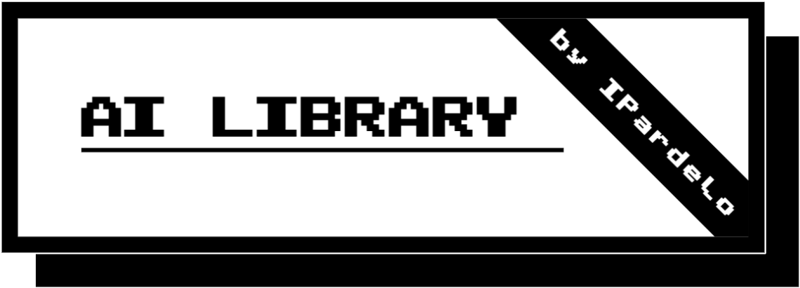

[][0]<br><br>

# AI library repository

## What is "The AI Library"?
Project created so that everyone has easy access to all free artificial intelligence websites. 100% of this project has been created with Google's Gemini AI &trade; under prompts generated by me. I have only collected the free websites and have exposed them in it.

## How to use "AI Library"
Choose the category to filter the tool you need and choose the one that best suits your needs.

## Contributing
To contribute to the project send a pull-request and wait for approval.

## Contributors
Special thanks in advance to all contributors. We sincerely thank you all.

## Installation and modification
If you have git installed, clone the repository with:
```
git clone https://github.com/IPardelo/ia-library.git
```


*****


>A project made by [Ismael Casti&ntilde;eira](https://github.com/IPardelo/)

[0]: https://ipardelo.github.io/ia-library/
